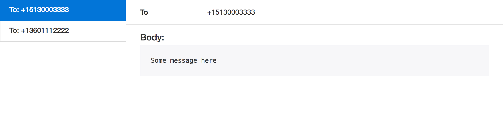

# Mouth [](https://travis-ci.org/Nebo15/mouth) [](https://coveralls.io/github/Nebo15/mouth?branch=master)


Simple adapter based SMS sending library

## Installation
This package can be installed
by adding `mouth` to your list of dependencies in `mix.exs`:

```elixir
def deps do
  [{:mouth, "~> 0.3.2"}]
end
```

## Adapters

* `Mouth.SMS2IPAdapter` - Simple SMS2IP adapter.
* `Mouth.TwilioAdapter` - Adapter for sending SMS through Twilio.
* `Mouth.LocalAdapter` - Delivers messages to an in-memory store. Useful for
  development when you don't want to send real SMS messages.
* `Mouth.TestAdapter` - Adapter for test environment.

## Getting Started

```elixir
# In your config/config.exs file
#
# There may be other adapter specific configuration you need to add.
config :my_app, MyApp.Messenger,
  adapter: Mouth.SMS2IPAdapter,
  source_number: "TEST_NUMBER",
  gateway_url: "localhost:4000",
  login: "test",
  password: "password"

# Somewhere in your application
defmodule MyApp.Messenger do
  use Mouth.Messenger, otp_app: :my_app
end

# Define your messages
defmodule MyApp.Message do
  import Mouth.Message

  def send_password do
    new_message(
      to: "+380931234567",
      body: "12345"
    )

    # or pipe using Mouth.Message functions
    new_message
    |> to("+380931234567")
    |> body("12345")
  end
end

# In a controller or some other module
Message.send_password |> Messenger.deliver
```

## Inbox preview in the browser

Mouth ships with a Plug that allows you to preview the messages in the local
(in-memory) mailbox. It's particularly convenient in development when you
want to check what your message will look like while testing the various flows
of your application.

For email to reach this mailbox you will need to set your `Mailer` adapter to
`Swoosh.Adapters.Local`:

```elixir
# in config/dev.exs
config :my_app, MyApp.Messenger,
  adapter: Mouth.LocalAdapter
```

Then, use the Mix task to start the inbox preview server:

```console
$ mix mouth.inbox.server
```

Or in your Phoenix project you can `forward` directly to the plug, like this:

```elixir
# in web/router.ex
if Mix.env == :dev do
  scope "/dev" do
    pipe_through [:browser]

    forward "/inbox", Plug.Mouth.InboxPreview, [base_path: "/dev/inbox"]
  end
end
```

If you are curious, this is how it looks:



## Contributing

Before opening a pull request, please open an issue first.

Once we've decided how to move forward with a pull request:

    $ git clone https://github.com/nebo15/mouth.git
    $ cd mouth
    $ mix deps.get
    $ mix test

Once you've made your additions and `mix test` passes, go ahead and open a PR!

## Thanks!
Thanks to cool guys from [Bamboo](https://github.com/thoughtbot/bamboo) for inspiration,
and [Swoosh](https://github.com/swoosh/swoosh) for the `LocalAdapter`.
